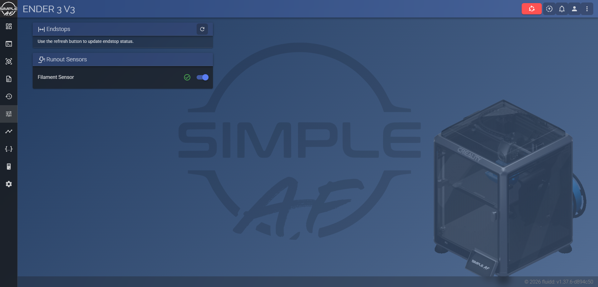
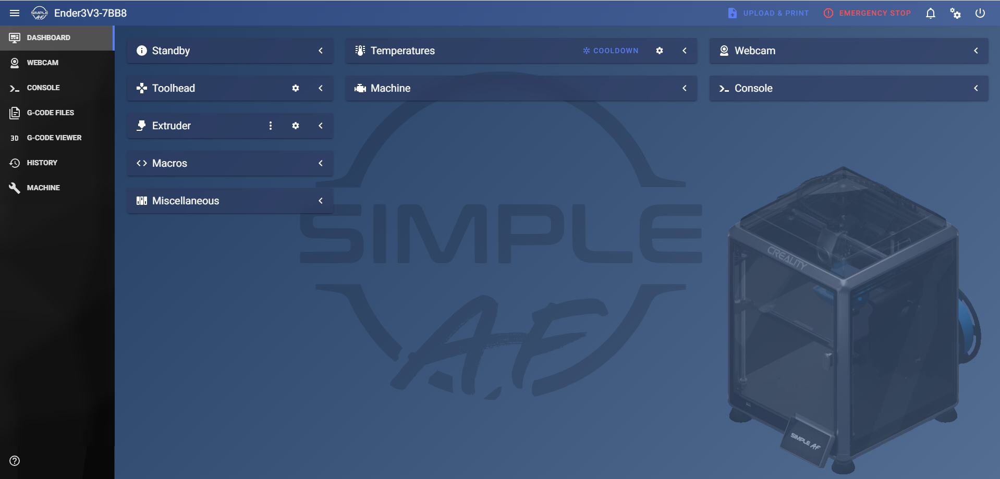

# Simple AF Theme - Chefs Edition

The [Simple AF](https://github.com/pellcorp/creality) Fluidd and Mainsail theme, plus an animated printer in the bottom right corner.

| Fluidd | Mainsail |
| --- | --- |
|  |  |

## Install

SSH into the printer and run:

**K1 series / Ender 3 V3**
```
cd /tmp && curl -sL https://github.com/sterling5241/simple-af-theme-chefs-edition/archive/refs/heads/main.tar.gz | tar -xz
rm -rf /usr/data/printer_data/config/.fluidd-theme /usr/data/printer_data/config/.theme
cp -r /tmp/simple-af-theme-chefs-edition-main/.fluidd-theme /tmp/simple-af-theme-chefs-edition-main/.theme /usr/data/printer_data/config/
```

**RPi**
```
cd /tmp && curl -sL https://github.com/sterling5241/simple-af-theme-chefs-edition/archive/refs/heads/main.tar.gz | tar -xz
rm -rf ~/printer_data/config/.fluidd-theme ~/printer_data/config/.theme
cp -r /tmp/simple-af-theme-chefs-edition-main/.fluidd-theme /tmp/simple-af-theme-chefs-edition-main/.theme ~/printer_data/config/
```

Then refresh the page (Ctrl+F5).

## Remove

**K1 series / Ender 3 V3**
```
rm -rf /usr/data/printer_data/config/.fluidd-theme /usr/data/printer_data/config/.theme
```

**RPi**
```
rm -rf ~/printer_data/config/.fluidd-theme ~/printer_data/config/.theme
```
